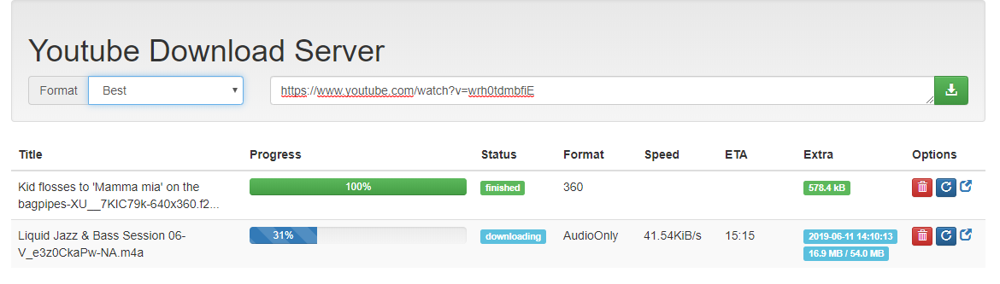

# YoutubeDL as a Web / REST server

Simple Web UI to queue downloads using the great [YoutubeDL](https://rg3.github.io/youtube-dl/)



It can also be used as a very simple REST api

## Configure

> cp youtubedl-web.yaml.example youtubedl-web.yaml

Modify the file to fit your needs.

Create multiple formats for downloading an audio only file or for selecting 
different video resolutions. You can also set a unique directory and output 
template for each format defined.


Read more about valid format configurations for youtube-dl [here](https://github.com/ytdl-org/youtube-dl/blob/master/README.md#format-selection) and valid output templates [here](https://github.com/ytdl-org/youtube-dl/blob/master/README.md#output-template).

## Multiple Workers on the Network

Create a network drive to store downloaded files. On each worker mount the 
storage in the local `./downloads/` directory so that all workers can save to it.

## Run in Docker

> No longer working I believe... looking for help here.

I plan to create new docker files.

```
docker build --tag youtubedl .
docker run -d -p "5000:5000" -v ./downloads:/downloads/ youtubedl
```
or
```
docker-compose up -d --build
```

## Using the API

```
curl -XPOST -d "url=$url" http://ip:5000/add/
```

```
curl -GET http://ip:5000/downloads
curl -GET http://ip:5000/downloads/format/<format>
curl -GET http://ip:5000/downloads/status/<status>
```

```
curl -XDELETE http://localho:5000/remove/<id>
```

```
curl -XPOST http://localho:5000/remove/<id>
```

## Roadmap

- [x] Config file
- [x] Extended API
- [x] Download Format Selection
- [x] Download hours (I have slow internet connection)
- [ ] Proper docker-compose deployment
- [ ] Alert on frontend when `youtube-dl` fails (likely needs updating)
- [ ] Download file from browser
- [ ] Watch output directories for removed files then remove item from store

### Development Ideas

I am not sure if these ideas should be built into this project or if 
another project should be started that uses this project simply as 
an API for downloading. Perhaps an RSS feed already exists that 
can be read from or use Youtube API... but that seems overkill.

- [ ] Watch a public youtube playlist for changes then download
- [ ] Watch youtube channel for updates and then download
